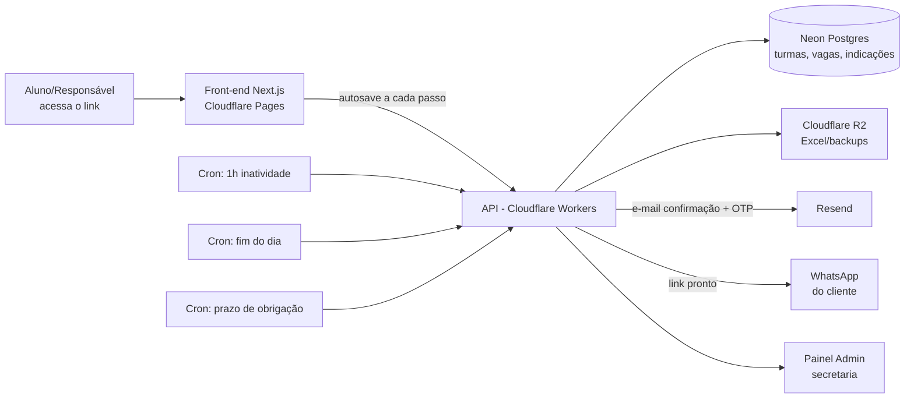

# Sistema de Matrícula Online — Redação Nota Mil (v2)

**Versão:** 2.0 · **Data:** Julho/2026 · **Prioridade:** Mobile-first

---

## 1. Visão Geral

Sistema de matrícula 100% online, acessado por um link único, onde o responsável/aluno preenche um formulário multi-etapas (wizard) para se matricular em cursos de Redação, Exatas e Matemática. O sistema salva o progresso automaticamente, controla vagas por turma, verifica o contato por e-mail, rastreia indicações, avisa a secretaria se o aluno abandonar o preenchimento, envia e-mails de confirmação, gera um resumo para WhatsApp e exporta um relatório diário em Excel.

**Dados da empresa (usados no sistema, e-mails e rodapés):**

| Campo | Valor |
|---|---|
| Nome | Redação Nota Mil |
| CNPJ | 51.241.242/0001-08 |
| Endereço | Rua F, Qd. 159, Lt. 01 — Parque Tremendão |
| Telefone | (62) 98189-9570 |
| Urgência | (62) 99555-1544 |
| E-mail | naredacaonota1000@gmail.com |

---

## 2. Diferenciais / Novidades do Sistema

- **Barra de progresso animada** mostrando "Passo 3 de 9 — 33% concluído", com nomes das etapas.
- **Cálculo de idade em tempo real** assim que a data de nascimento é digitada (decide sozinho se o Passo 2 aparece ou é pulado).
- **Autosave silencioso** com **indicador visual** (iconezinho de nuvem com check ao lado do campo, tipo "☁️✓ salvo") — o aluno vê que pode fechar a aba sem medo de perder o progresso.
- **Vagas restantes visíveis** em cada turma ("restam 4 vagas") — cria urgência real e evita lotar sem ninguém perceber.
- **Lista de espera automática** quando uma turma lota.
- **Sugestão automática de turma pela série** — o sistema já filtra e destaca a turma certa pra idade/série do aluno.
- **Código de indicação** gerado ao final da matrícula, pra quem escolheu a Modalidade "Com desconto".
- **Verificação de e-mail por código** antes de liberar a confirmação final — garante que o contato é real.
- **Detecção de duplicidade** — evita duas matrículas da mesma pessoa na mesma turma.
- **Máscaras inteligentes** de telefone, CPF e data, com validação instantânea.
- **Transições suaves entre passos** (slide/fade), sensação de app nativo.
- **Modo claro/escuro automático** conforme o celular do usuário.
- **Resumo "flutuante"** sempre visível (ou acessível por um botão) com curso(s) e valor escolhido até agora.
- **Anti-robô discreto** (Cloudflare Turnstile).
- **Recuperação de matrícula abandonada** — ao voltar no link, o sistema pergunta se quer continuar de onde parou.
- **Edição pós-matrícula** — link separado pra atualizar telefone/e-mail sem mexer no resto.
- **"Declaração digital"** — nome digitado + data/hora + IP registrados como prova de ciência dos avisos.

---

## 3. Stack Tecnológica Recomendada

| Camada | Tecnologia sugerida | Por quê |
|---|---|---|
| Front-end | Next.js (React) + Tailwind CSS, no **Cloudflare Pages** | Mobile-first fácil com Tailwind; roda bem no Cloudflare |
| Animações | Framer Motion | Transições suaves entre passos do wizard |
| Back-end / API | **Cloudflare Workers** (framework Hono) | Serverless, rápido, integra nativamente com o resto do Cloudflare |
| Banco de dados | **Neon** (Postgres serverless) + Drizzle ORM | Type-safe, evita SQL injection, controla vagas com transações seguras |
| Arquivos (Excel, backups) | **Cloudflare R2** | Armazenamento barato, sem taxa de saída de dados |
| E-mail transacional | **Resend** | Ótima integração com Workers; usada tanto pros e-mails de confirmação quanto pro código de verificação (OTP) |
| Tarefas agendadas (inatividade, Excel diário, prazo de obrigação) | **Cloudflare Cron Triggers** | Workers agendados, sem servidor 24h |
| Anti-bot | **Cloudflare Turnstile** | Gratuito, discreto |
| Autenticação do painel admin | Sessão com cookie httpOnly + senha, ou **Cloudflare Access** | Só a secretaria acessa |
| Geração do Excel | Biblioteca `exceljs` | Roda no Worker/cron job |
| Versionamento / Deploy | **GitHub** + GitHub Actions | Deploy automático a cada push |

---

## 4. Arquitetura (visão geral)



---

## 5. Segurança e LGPD

- **Consentimento explícito** no início do formulário, com checkbox de aceite conforme a LGPD.
- **Verificação de e-mail por código (OTP)** antes da confirmação final — garante que o e-mail informado é real e funciona também como prova extra de ciência dos avisos.
- **Detecção de duplicidade**: antes de finalizar, o sistema checa se já existe uma matrícula com o mesmo CPF, e-mail ou telefone **na mesma turma**. Se encontrar, não cria uma segunda matrícula — gera um alerta para a secretaria decidir o que fazer.
- **Coleta mínima**: CPF/RG opcionais, como definido.
- **Criptografia** em trânsito (HTTPS via Cloudflare) e em repouso (Neon).
- **Validação em dois níveis** (navegador + servidor).
- **Rate limiting** nas rotas da API.
- **Painel admin protegido** por login com senha forte.
- **Log de auditoria**: toda alteração feita por um admin (mudar modalidade, marcar obrigação cumprida, mover aluno de turma) fica registrada com usuário, data e o que mudou.
- **Backups automáticos** (Neon point-in-time recovery).
- **Direito de exclusão** de dados a pedido do titular.

---

## 6. Regras de Negócio — Cursos e Turmas

O aluno pode escolher **apenas uma turma por matéria**. No **Passo 3**, o sistema já filtra e destaca automaticamente as turmas compatíveis com a série informada no Passo 1 — turmas de outra faixa (ex.: Ensino Médio pra quem está no fundamental) nem aparecem na lista principal.

Cada turma tem um **número máximo de vagas configurável no painel admin**. Quando as vagas acabam, a turma aparece como **"Lotada"** e, no lugar do botão de selecionar, aparece **"Entrar na lista de espera"** — a secretaria é avisada e pode remanejar quando abrir vaga.

### Redação — Ensino Médio (duração da aula: 1h30)

| Turma | Dia | Horário |
|---|---|---|
| R1 | Terça | 18h00 – 19h30 |
| R2 | Terça | 19h30 – 21h00 |
| R3 | Sábado | 07h30 – 09h00 |
| R4 | Sábado | 09h00 – 10h30 |

### Redação — Ensino Fundamental (duração da aula: 1h30)

| Turma | Série | Dia | Horário |
|---|---|---|---|
| R5 | 6º e 7º ano | Sábado | 10h30 – 12h00 |
| R6 | 8º e 9º ano | Sábado | 15h00 – 16h30 |

### Exatas (Física, Matemática, Química) — Ensino Médio

| Turma | Dia | Horário |
|---|---|---|
| EX1 | Segunda | 19h00 – 22h00 (bloco de 3h, ~1h por matéria) |

### Matemática Específica — Ensino Fundamental (duração da aula: 1h)

| Turma | Dia | Horário |
|---|---|---|
| MF1 | Sábado | 13h30 – 14h30 |

> ⚠️ Número de vagas por turma não foi definido — deixei como configuração livre no admin (você define quantas vagas cada turma tem antes de lançar o sistema).

---

## 7. Fluxo Completo da Matrícula

Barra de progresso visível em todos os passos. A cada campo preenchido → autosave (local + servidor) com indicador visual de "salvo".

### Passo 1 — Dados do Aluno
**Obrigatórios:** nome completo, data de nascimento (idade calculada automaticamente), e-mail, telefone/WhatsApp, série atual, onde estuda.
**Opcionais:** CPF, RG, endereço.
**Novos campos:**
- **Como conheceu a Redação Nota Mil?** (opcional) — select: Indicação de amigo/aluno · Instagram · Google · Outro.
- **Código de indicação** (opcional) — campo de texto tipo "Tem um código de indicação? (opcional)". Se preenchido, o sistema valida e já vincula esse aluno a quem indicou.

### Passo 2 — Dados dos Responsáveis *(só aparece se menor de 18 anos)*
Nome do pai + telefone · Nome e telefone da mãe.

### Passo 3 — Selecionar Turma e Horário
Mostra as turmas já filtradas pela série do aluno (Passo 1), com **vagas restantes visíveis** em cada card (ex.: "restam 4 vagas"). Se uma turma estiver lotada, mostra **"Lotada — Entrar na lista de espera"** no lugar do botão normal. Permite 1 turma por matéria (Redação, Exatas, Matemática).

### Passo 4 — Informações do Curso (confirmação)
Avisos por matéria selecionada:

> **📝 Redação:** Cada aula tem 1h30 de duração. Se for faltar, avise com 3 horas de antecedência para reagendarmos a reposição. Avisos são publicados no grupo — fique bem atento.

> **📐 Exatas:** Cada aula tem 1h de duração. Este curso não tem reposição, a não ser que os professores marquem uma. Avisos são publicados no grupo — fique bem atento.

> **🧮 Matemática:** Cada aula tem 1h de duração. Avisos são publicados no grupo — fique bem atento.

Checkbox obrigatório: **"Li e estou ciente das informações acima"**.

### Passo 5 — Modalidade e Valores
⚠️ *"Depois de escolher a modalidade não é possível voltar atrás pelo site. Pense bem antes de confirmar — para alterar depois, é só na secretaria."*
Valores só aparecem **depois** de escolher a modalidade.

| Modalidade | Obrigações | Redação | Exatas | Matemática |
|---|---|---|---|---|
| **1 — Com desconto** | Divulgar (WhatsApp e Instagram) + trazer 1 aluno novo | R$ 150 | R$ 150 | R$ 150 |
| **2 — Desconto parcial** | Divulgar (WhatsApp e Instagram) | R$ 200 | R$ 200 | R$ 200 |
| **3 — Normal** | Nenhuma | R$ 250 | R$ 300 | R$ 250 |

*Mostra o valor só do(s) curso(s) já selecionado(s) no Passo 3.*

**Taxa de matrícula:** R$ 100 (1 curso) · R$ 50 (2 cursos).
**Se não cumprir as obrigações da modalidade escolhida, o curso volta automaticamente para o valor da Modalidade 3.** O prazo pra cumprir é acompanhado pelo painel admin (veja seção 13).

Se a modalidade escolhida for **1**, ao final da matrícula (Passo Final) o sistema gera um **código de indicação único** pro aluno (ex.: `JOAO-REDACAO-482`), mostrado na tela e enviado por e-mail, pra ele compartilhar com quem for indicar.

### Passo 5.1 — Plano de Pagamento

**Plano Mensal** — paga mês a mês, no valor da tabela acima.

**Plano Trimestral** (Agosto, Setembro, Outubro):

| Modalidade | Redação | Exatas | Matemática |
|---|---|---|---|
| 1 | R$150 × 3 = **R$ 450** | R$150 × 3 = **R$ 450** | R$150 × 3 = **R$ 450** |
| 2 | R$200 × 3 = **R$ 600** | R$200 × 3 = **R$ 600** | R$200 × 3 = **R$ 600** |
| 3 | R$250 × 3 = **R$ 750** | R$300 × 3 = **R$ 900** | R$250 × 3 = **R$ 750** |

**Plano Total** (Agosto, Setembro, Outubro, Novembro — 2 aulas):

| Modalidade | Redação | Exatas | Matemática |
|---|---|---|---|
| 1 | R$150 × 4 = **R$ 600** | R$150 × 4 = **R$ 600** | R$150 × 4 = **R$ 600** |
| 2 | R$200 × 4 = **R$ 800** | R$200 × 4 = **R$ 800** | R$200 × 4 = **R$ 800** |
| 3 | R$250 × 4 = **R$ 1.000** | R$300 × 4 = **R$ 1.200** | R$250 × 4 = **R$ 1.000** |

### Passo 6 — Forma de Pagamento
- **Dinheiro à vista** → 5% de desconto adicional sobre o valor do plano.
- **Cartão (crédito ou débito)** → sujeito à taxa da maquininha (configurável no admin).
- **Pix** → dados enviados pelo WhatsApp da empresa após o pedido de matrícula.

*Só informativo — sem cobrança online.*

### Passo 7 — Rematrícula Automática
Puxa forma de pagamento e turma escolhidas. Se Pix → número do aluno (ou de um dos pais, se menor).
*"A modalidade escolhida vale até o fim do curso. Só é possível alterar na secretaria."*
Pergunta: **Ativar rematrícula automática? Sim / Não**

### Passo 8 — Avisos Finais e Ciência
- Pagamento vence todo dia 5 do mês. Se não conseguir pagar em dia, é só avisar a secretaria.
- Faltas na Redação → falar com a secretaria para agendar a reposição.
- Cada bloco de aviso tem seu próprio checkbox **"Estou ciente"**.

### Passo 9 — Verificação de E-mail e Revisão Final
Antes de liberar o botão de confirmar, o sistema:
1. Envia um **código de 4 dígitos por e-mail** para o endereço informado no Passo 1.
2. O usuário digita o código na tela para desbloquear a confirmação (código expira em alguns minutos; tem botão "reenviar código").
3. Depois de verificado, mostra o resumo completo (aluno, curso, turma, modalidade, plano, valor, forma de pagamento) e pede para confirmar e-mail e telefone.

Botão **"Confirmar e Fazer Matrícula"** → estado de carregamento até salvar e enviar os e-mails → tela de confirmação.

Antes de gravar como concluída, o sistema roda a **checagem de duplicidade** (mesmo CPF/e-mail/telefone já matriculado na mesma turma) — se encontrar, não finaliza automaticamente e sinaliza pra secretaria revisar.

### Passo Final — Registro no WhatsApp
Mostra um resumo visual da matrícula (e o código de indicação, se aplicável) e um botão **"Enviar registro no WhatsApp"**, que abre o WhatsApp com a mensagem pronta para **(62) 98189-9570**. O cliente confirma e envia — isso é o registro oficial.

---

## 8. Autosave / Cache

- A cada campo preenchido (~800ms de atraso), salva local **e** no servidor, com um `token` de sessão único.
- Indicador visual de "salvo" (nuvem com check) ao lado do campo.
- Se o aluno fechar e voltar pelo mesmo link, o sistema recupera o progresso e pergunta se quer continuar.

---

## 9. Fluxo de Abandono (1h de Inatividade)

Cron job verifica matrículas com `status = "em_andamento"` e `última atividade > 1 hora`. Envia e-mail **para naredacaonota1000@gmail.com**:

> **Assunto:** ⚠️ Matrícula não finalizada — [Nome do aluno, se preenchido]
>
> Olá, equipe Redação Nota Mil!
>
> Uma matrícula ficou parada há mais de 1 hora. Segue o que já foi preenchido:
>
> - **Nome:** [nome ou "não preenchido"]
> - **Idade:** [idade ou "—"]
> - **E-mail:** [email ou "—"]
> - **Telefone/WhatsApp:** [telefone ou "—"]
> - **Série:** [série ou "—"]
> - **Onde estuda:** [escola ou "—"]
> - **Como conheceu:** [origem ou "—"]
> - **Curso(s) em andamento:** [curso(s) selecionado(s), se houver]
> - **Último passo preenchido:** Passo [X] de 9
> - **Parou às:** [data e hora]
>
> Se quiser, dá pra chamar no WhatsApp/e-mail cadastrado e ajudar a concluir. 😊
>
> — Sistema de Matrícula, Redação Nota Mil

Cada registro dispara só **um** e-mail de abandono.

---

## 10. E-mails de Confirmação de Matrícula

Enviados para o e-mail do cliente **e** para naredacaonota1000@gmail.com ao concluir o Passo 9.

> **Assunto:** ✅ Matrícula confirmada — [Nome do aluno] | Redação Nota Mil
>
> Olá, [Nome do aluno / responsável]!
>
> Sua matrícula na **Redação Nota Mil** foi recebida com sucesso. Aqui está o resumo:
>
> **Aluno:** [nome] · [idade] anos
> **Curso(s):** [curso] — Turma [X] · [dia] das [horário]
> **Modalidade:** [modalidade escolhida]
> **Plano:** [mensal/trimestral/total] — [detalhamento do cálculo]
> **Forma de pagamento:** [forma escolhida]
> **Taxa de matrícula:** R$ [valor]
> **Rematrícula automática:** [sim/não]
> [Se Modalidade 1] **Seu código de indicação:** `[CODIGO]` — compartilhe com quem você for indicar!
>
> Próximo passo: envie o resumo da sua matrícula pelo WhatsApp da nossa equipe para confirmarmos tudo certinho.
>
> Quer atualizar seu telefone ou e-mail depois? [Link de edição de dados básicos]
>
> Qualquer dúvida, fale com a gente:
> 📞 (62) 98189-9570 · urgência (62) 99555-1544
> ✉️ naredacaonota1000@gmail.com
> 📍 Rua F, Qd. 159, Lt. 01 — Parque Tremendão
>
> Bem-vindo(a) à Redação Nota Mil! 🎉

**E-mail de verificação (OTP), enviado no Passo 9:**

> **Assunto:** Seu código de verificação — Redação Nota Mil
>
> Olá! Seu código para confirmar a matrícula é: **[0000]**
> Ele expira em alguns minutos. Se você não pediu esse código, pode ignorar este e-mail.

---

## 11. Mensagem para o WhatsApp (Passo Final)

Link `https://wa.me/5562981899570?text=...` com a mensagem pronta:

> Olá! Acabei de concluir minha matrícula na Redação Nota Mil. Segue meu resumo:
>
> 👤 Aluno: [nome]
> 📚 Curso: [curso] — Turma [X]
> 💳 Modalidade: [modalidade] · Plano: [plano]
> 💰 Valor: R$ [valor]
> 📱 Contato: [telefone]
>
> Este é o registro da minha matrícula. Obrigado(a)!

---

## 12. Exportação Diária em Excel

Cron ao fim do dia gera `.xlsx` com as matrículas **concluídas** naquele dia, salvo no Cloudflare R2.

**Colunas:**

| Coluna |
|---|
| Data/Hora da matrícula |
| Nome completo do aluno |
| Data de nascimento / Idade |
| E-mail (verificado) |
| Telefone/WhatsApp |
| Série atual / Onde estuda |
| CPF / RG / Endereço (se preenchidos) |
| Nome do pai / telefone |
| Nome da mãe / telefone |
| Como conheceu a empresa |
| Curso(s) e turma(s) |
| Modalidade |
| Status da obrigação (pendente/cumprida/não cumprida) |
| Código de indicação gerado / código usado (se houver) |
| Plano de pagamento |
| Valor mensal / Valor total do plano |
| Forma de pagamento |
| Rematrícula automática (Sim/Não) |
| Status (Concluída / Abandonada / Alerta de duplicidade) |

---

## 13. Painel Administrativo

- Login protegido para a secretaria.
- Lista de matrículas com filtros por data, curso, turma e status.
- Clicar numa matrícula → ver todos os detalhes preenchidos.
- **Gestão de turmas:** definir/editar número de vagas por turma, ver vagas ocupadas e lista de espera de cada uma.
- **Cumprimento de obrigação (modalidades 1 e 2):** marcar manualmente "Divulgou: sim/não" e "Trouxe aluno: sim/não" (só modalidade 1); o sistema mostra um alerta quando o prazo definido passar sem a obrigação marcada como cumprida, e sinaliza a matrícula pra voltar ao valor normal.
- **Indicações:** ver quem gerou qual código e quem usou cada código, pra cruzar com o cumprimento da obrigação.
- **Alertas de duplicidade:** fila separada com matrículas que bateram CPF/e-mail/telefone com outra já existente, pra secretaria decidir.
- **Histórico de alterações (auditoria):** log de quem mudou o quê e quando (modalidade, obrigação, turma).
- Botão **"Baixar Excel de hoje"** (ou de um período).
- Indicador simples de quantas matrículas foram feitas no dia/semana.

---

## 14. Edição de Dados Básicos Pós-Matrícula

Cada matrícula concluída gera um **link único de edição** (enviado no e-mail de confirmação), que permite ao aluno/responsável atualizar **apenas telefone e e-mail** depois — sem tocar em modalidade, plano ou turma (que só mudam na secretaria, como definido).

---

## 15. Modelo de Dados (rascunho do schema)

```sql
-- alunos
CREATE TABLE students (
  id UUID PRIMARY KEY DEFAULT gen_random_uuid(),
  full_name TEXT NOT NULL,
  birth_date DATE NOT NULL,
  email TEXT NOT NULL,
  phone TEXT NOT NULL,
  grade TEXT NOT NULL,
  school TEXT NOT NULL,
  cpf TEXT,
  rg TEXT,
  address TEXT,
  referral_source TEXT, -- 'indicacao' | 'instagram' | 'google' | 'outro'
  created_at TIMESTAMPTZ DEFAULT now()
);

-- responsáveis
CREATE TABLE guardians (
  id UUID PRIMARY KEY DEFAULT gen_random_uuid(),
  student_id UUID REFERENCES students(id),
  father_name TEXT,
  father_phone TEXT,
  mother_name TEXT,
  mother_phone TEXT
);

-- turmas (com controle de vagas)
CREATE TABLE classes (
  id UUID PRIMARY KEY DEFAULT gen_random_uuid(),
  code TEXT UNIQUE NOT NULL,        -- 'R1', 'EX1', 'MF1'...
  subject TEXT NOT NULL,
  weekday TEXT NOT NULL,
  start_time TIME NOT NULL,
  end_time TIME NOT NULL,
  grade_range TEXT,
  max_seats INTEGER NOT NULL,
  seats_taken INTEGER DEFAULT 0
);

-- lista de espera
CREATE TABLE waitlist (
  id UUID PRIMARY KEY DEFAULT gen_random_uuid(),
  class_id UUID REFERENCES classes(id),
  student_id UUID REFERENCES students(id),
  created_at TIMESTAMPTZ DEFAULT now()
);

-- matrícula
CREATE TABLE enrollments (
  id UUID PRIMARY KEY DEFAULT gen_random_uuid(),
  student_id UUID REFERENCES students(id),
  modality TEXT NOT NULL,             -- 'desconto' | 'desconto_parcial' | 'normal'
  plan TEXT NOT NULL,                  -- 'mensal' | 'trimestral' | 'total'
  payment_method TEXT NOT NULL,
  auto_renew BOOLEAN DEFAULT false,
  status TEXT DEFAULT 'em_andamento',  -- 'em_andamento' | 'concluida' | 'abandonada' | 'alerta_duplicidade'
  current_step INTEGER DEFAULT 1,
  session_token TEXT UNIQUE,
  edit_token TEXT UNIQUE,              -- link de edição pós-matrícula
  abandoned_notified BOOLEAN DEFAULT false,
  email_verified BOOLEAN DEFAULT false,
  email_otp_code TEXT,
  email_otp_expires_at TIMESTAMPTZ,
  obligation_status TEXT DEFAULT 'pendente', -- 'pendente' | 'cumprida' | 'nao_cumprida'
  obligation_deadline DATE,
  last_activity_at TIMESTAMPTZ DEFAULT now(),
  created_at TIMESTAMPTZ DEFAULT now(),
  completed_at TIMESTAMPTZ
);

-- cursos/turmas escolhidos dentro de uma matrícula
CREATE TABLE enrollment_courses (
  id UUID PRIMARY KEY DEFAULT gen_random_uuid(),
  enrollment_id UUID REFERENCES enrollments(id),
  class_id UUID REFERENCES classes(id)
);

-- códigos de indicação
CREATE TABLE referrals (
  id UUID PRIMARY KEY DEFAULT gen_random_uuid(),
  referrer_enrollment_id UUID REFERENCES enrollments(id),
  code TEXT UNIQUE NOT NULL,
  referred_enrollment_id UUID REFERENCES enrollments(id),
  created_at TIMESTAMPTZ DEFAULT now()
);

-- auditoria do painel admin
CREATE TABLE admin_audit_log (
  id UUID PRIMARY KEY DEFAULT gen_random_uuid(),
  admin_user TEXT NOT NULL,
  enrollment_id UUID REFERENCES enrollments(id),
  action TEXT NOT NULL,        -- 'alterou_modalidade' | 'marcou_obrigacao_cumprida' | 'moveu_turma' ...
  details TEXT,
  created_at TIMESTAMPTZ DEFAULT now()
);
```

---

## 16. Roadmap Sugerido

**Fase 1 — MVP (tudo o que está descrito acima)**
- Fluxo completo dos 9 passos + autosave com indicador visual
- Vagas por turma + lista de espera
- Sugestão automática de turma pela série
- Código de indicação (Modalidade 1)
- Verificação de e-mail por código antes da confirmação
- Detecção de duplicidade
- Painel admin com cumprimento de obrigação, auditoria, gestão de vagas e indicações
- E-mails de confirmação e de abandono
- Exportação diária em Excel
- Link de WhatsApp com mensagem pronta
- Edição de dados básicos pós-matrícula

**Fase 2 — Melhorias futuras**
- Pagamento online automático (Pix via gateway)
- Envio automático via WhatsApp Business API
- Lembrete automático de pagamento (2-3 dias antes do dia 5)
- Convite de calendário (.ics) no e-mail de confirmação
- Contrato em PDF gerado automaticamente
- Carnê de pagamento em PDF
- Painel admin com estatísticas (cursos mais procurados, taxa de abandono, receita prevista)
- Prova social na tela inicial
- Pesquisa de satisfação (NPS) após 1 mês de aula

---

## 17. Pontos que Ajustei / Faltam Definir — Confirme Comigo

1. **Turma R2 (Redação):** ajustei "19h30 às 19h" para **19h30 às 21h**, mantendo a aula de 1h30.
2. **Turma R6 (Redação Fundamental):** sem dia informado — assumi **Sábado**, mesmo dia da R5.
3. **Plano Total, Modalidade 3:** corrigido de "× 3" para "× 4", padronizando com as outras modalidades.
4. **Taxa de matrícula:** R$ 100 (1 curso) e R$ 50 (2 cursos) — mantive como você descreveu, só confirmando que a lógica "mais barato com 2 cursos" é intencional.
5. **Taxa da maquininha (cartão):** deixei configurável no admin, já que varia.
6. **Número de vagas por turma:** não foi definido — fica configurável no admin antes de lançar.
7. **Prazo pra cumprir a obrigação (modalidades 1 e 2):** não foi definido quantos dias após a matrícula. Sugiro, por exemplo, 30 dias — mas isso é 100% configurável, só preciso que você defina o número.
8. **Passo 2 (responsáveis):** deixei nome + telefone do pai **e** da mãe, mas se o aluno morar só com um dos dois, talvez faça sentido aceitar preencher só um. Me avisa se quiser esse ajuste.

---

## 18. Próximos Passos

1. Criar o repositório no GitHub e configurar Cloudflare Pages + Workers.
2. Modelar o banco no Neon com o schema acima.
3. Cadastrar as turmas com seus respectivos limites de vagas.
4. Construir o wizard do front-end passo a passo.
5. Configurar Resend (e-mails + OTP) e Cloudflare Cron Triggers (abandono, Excel diário, prazo de obrigação).
6. Construir o painel admin, já com gestão de vagas, indicações e auditoria.

Quer que eu já comece pelo código do primeiro passo (formulário com cálculo de idade e autosave), ou prefere ver antes um protótipo visual das telas?
