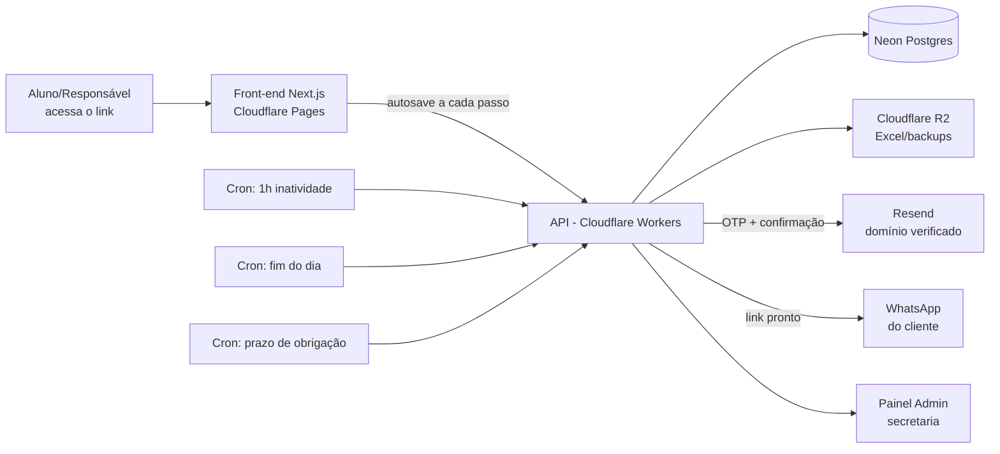

# Sistema de Matrícula Online — Redação Nota Mil

**Versão:** 2.0 — Redesign visual e melhorias completas · **Data:** Julho/2026 · **Prioridade:** Mobile-first

---

## 1. Visão Geral

Sistema de matrícula 100% online, acessado por um link único, com identidade visual própria, controle de vagas, verificação de contato, rastreio de indicação e envio automático de e-mails e resumo por WhatsApp.

**Dados da empresa:**

| Campo | Valor |
|---|---|
| Nome | Redação Nota Mil |
| CNPJ | 51.241.242/0001-08 |
| Endereço | Rua F, Qd. 159, Lt. 01 — Parque Tremendão |
| Telefone | (62) 98189-9570 |
| Urgência | (62) 99555-1544 |
| E-mail | naredacaonota1000@gmail.com |

---

## 2. Sistema de Design — Cores, Tipografia e Estilo

Pra fugir do "formulário genérico", a identidade visual do sistema parte do próprio universo da redação: tinta, papel e o selo de quem tira nota máxima. Nada de azul-roxo de SaaS genérico — a paleta abaixo é exclusiva pra esse projeto.

### Paleta de cores

| Token | Cor aproximada | Hex | Uso |
|---|---|---|---|
| `tinta-900` (primária) | 🟦 Azul-tinta escuro | `#14213D` | Textos principais, cabeçalhos, botões primários, ícones |
| `papel-50` (fundo) | ⬜ Branco frio | `#F7F8FA` | Fundo geral das telas — branco "de papel", não creme |
| `grifa-500` (destaque/CTA) | 🟨 Dourado marca-texto | `#F2B705` | Botão de ação principal, Selo Nota Mil, valores em destaque |
| `sucesso-600` / maior de idade | 🟩 Verde | `#16A34A` | Badge "maior de idade", vaga disponível, sucesso |
| `menor-500` / menor de idade | 🌸 Rosa | `#EC4899` | Badge "menor de idade" |
| `alerta-500` | 🟧 Âmbar | `#F59E0B` | Últimas vagas, avisos importantes |
| `erro-600` | 🟥 Vermelho | `#DC2626` | Turma lotada, erro de validação, campo obrigatório |
| `info-500` | 🟪 Índigo | `#6366F1` | Lista de espera, informações neutras |
| `tinta-100` (bordas) | ⬛ Cinza-azulado claro | `#E4E7EC` | Bordas, divisores, cards neutros |

*A cor da idade (rosa/verde) é sempre a mesma em qualquer lugar do sistema onde a idade aparece — no formulário, no resumo, no e-mail e no Excel — pra dar consistência visual imediata.*

### Tipografia

| Papel | Fonte | Onde usar |
|---|---|---|
| Display (títulos, número do passo, valores grandes) | **Fraunces** (serifada, peso 600–900) | Títulos de cada passo, valores em destaque, "Selo Nota Mil" |
| Corpo (formulário, textos, avisos) | **Inter** | Todo o texto do formulário — alta legibilidade em tela pequena |
| Dados (valores, códigos, badges) | **IBM Plex Mono** | Código de indicação, valores em R$, timestamps — dá um ar "carimbado/corrigido" |

### Elemento de assinatura: o "Selo Nota Mil"

Um carimbo circular dourado (`grifa-500`) com "1000" e um check, usado com moderação em só três momentos: ao concluir um passo importante (microanimação rápida), na tela de confirmação final, e no card-resumo enviado pro WhatsApp. Não aparece em todo canto — é o "uau" reservado pros momentos que importam.

### Layout e movimento

- Barra de progresso no topo funciona como uma **linha de caderno**: preenche em `tinta-900` conforme os passos avançam, com o rótulo "Passo X de 9" e o nome do passo atual.
- Cards com cantos arredondados (12–16px), sombra suave, nada de bordas retas tipo jornal.
- Transições entre passos: fade + slide leve (200–300ms). Botão de ação fixo na parte inferior da tela (fácil de alcançar com o polegar no celular).
- Toda microanimação respeita configuração de "movimento reduzido" do aparelho.
- Modo claro/escuro automático, mantendo a mesma paleta (no escuro, `papel-50` vira `tinta-900` e vice-versa nos textos).

---

## 3. Diferenciais / Novidades do Sistema

- Barra de progresso "linha de caderno" com nome de cada passo.
- Cálculo de idade em tempo real, com **badge colorido** (🌸 rosa = menor · 🟩 verde = maior).
- **Verificação de e-mail antecipada**: o código de confirmação já é enviado assim que o e-mail é digitado no Passo 1, não só no fim — o aluno já chega no Passo 9 com o código na caixa de entrada, sem esperar.
- Autosave silencioso com indicador visual (nuvem com check) ao lado do campo.
- Vagas restantes visíveis, com cor conforme a disponibilidade (verde / âmbar / vermelho).
- Lista de espera automática quando uma turma lota.
- Sugestão automática de turma pela série do aluno, com selo "Recomendada pra você".
- Código de indicação gerado ao final, pra quem está na Modalidade 1.
- Detecção de duplicidade de matrícula.
- Confirmação de ciência **por matéria**, não só um checkbox genérico no fim.
- Isenção automática da taxa de matrícula pra quem já é aluno de todos os módulos, incluindo férias.
- Edição pós-matrícula (telefone/e-mail) via link próprio.
- "Selo Nota Mil" nos momentos de confirmação.
- Anti-robô discreto (Cloudflare Turnstile).
- Recuperação de matrícula abandonada ao voltar no link.

---

## 4. Stack Tecnológica Recomendada

| Camada | Tecnologia | Por quê |
|---|---|---|
| Front-end | Next.js + Tailwind CSS, no **Cloudflare Pages** | Mobile-first, fácil de aplicar o sistema de design acima |
| Animações | Framer Motion | Transições da "linha de caderno" e do Selo Nota Mil |
| Back-end / API | **Cloudflare Workers** (Hono) | Serverless, integrado ao resto do Cloudflare |
| Banco de dados | **Neon** (Postgres) + Drizzle ORM | Type-safe, controla vagas com transações seguras |
| Arquivos (Excel, backups) | **Cloudflare R2** | Barato, sem taxa de saída |
| E-mail transacional | **Resend** + React Email | Templates com a mesma identidade visual do sistema |
| Tarefas agendadas | **Cloudflare Cron Triggers** | Inatividade, Excel diário, prazo de obrigação |
| Anti-bot | **Cloudflare Turnstile** | Discreto, gratuito |
| Domínio e DNS | **Cloudflare Registrar + DNS** | Necessário pra verificar o domínio no Resend (ver seção 6) |
| Admin (auth) | Sessão com cookie httpOnly + senha, ou Cloudflare Access | Só a secretaria acessa |
| Geração do Excel | `exceljs` | Roda no Worker/cron job |
| Versionamento / Deploy | **GitHub** + GitHub Actions | Deploy automático a cada push |

---

## 5. Arquitetura



---

## 6. Configuração do Resend — Verificado e Corrigido

Aqui provavelmente está a causa do envio de e-mail "não funcionar": **não é possível enviar e-mails a partir de um endereço @gmail.com pelo Resend.** O Resend exige que você comprove a posse de um **domínio próprio** (algo como `redacaonotamil.com.br`) através de registros de DNS — e ninguém consegue adicionar registros de DNS dentro do domínio `gmail.com`, porque ele não é seu. É por isso que usar `naredacaonota1000@gmail.com` como remetente ("From") nunca vai funcionar, mesmo com a API key certa.

**A boa notícia:** isso não muda nada pro cliente — o e-mail `naredacaonota1000@gmail.com` continua sendo usado normalmente como **destinatário** (pra onde a empresa recebe os avisos), só não pode ser o remetente técnico.

### Passo a passo correto

1. **Registrar um domínio** para a empresa (ex.: `redacaonotamil.com.br`) — pode ser pelo próprio **Cloudflare Registrar**, já que vocês usam Cloudflare.
2. No painel do **Resend → Domains → Add Domain**, cadastrar esse domínio. O Resend vai gerar registros de DNS (geralmente TXT/SPF e DKIM, às vezes um registro adicional).
3. Adicionar exatamente esses registros no **Cloudflare DNS** do domínio (é rápido porque já está tudo no mesmo painel). A verificação costuma sair em poucos minutos, podendo levar até 1h dependendo da propagação.
4. Voltar no Resend e clicar em **Verify** — o domínio precisa aparecer como "Verified" antes de qualquer envio funcionar.
5. Criar a **API Key**: Resend → API Keys → Create API Key → escolher o escopo **"Sending access"** (não "Full access", que dá permissão demais pra uma aplicação só enviar e-mail) — se possível, restringir a key ao domínio verificado.
6. Guardar essa chave como **variável de ambiente/secret no Cloudflare Workers** — nunca commitar no GitHub.
7. Enviar os e-mails do sistema a partir de um endereço do domínio próprio, por exemplo `matricula@redacaonotamil.com.br`, com o campo **Reply-To** apontando para `naredacaonota1000@gmail.com` — assim, se o cliente responder o e-mail, a resposta cai na caixa de entrada de sempre.
8. Os e-mails **internos** (aviso de abandono, cópia da matrícula pra empresa) continuam sendo enviados **para** `naredacaonota1000@gmail.com` normalmente — isso nunca foi o problema.

### Outros pontos técnicos confirmados

- O Resend exige que todo envio tenha **From, To, Subject e corpo (HTML ou texto) preenchidos** — um Subject vazio, por exemplo, é rejeitado. Vale validar isso no backend antes de chamar a API.
- **Limite de envio:** cerca de 2 e-mails/segundo no plano gratuito e 10/segundo no plano pago, com o limite liberando de novo a cada 60 segundos. No volume desse negócio (mesmo mandando os 2-3 e-mails de uma matrícula ao mesmo tempo) isso não chega a ser um problema, mas é bom não disparar centenas de e-mails de uma vez em uma migração de dados, por exemplo.
- Use a biblioteca **React Email** (do próprio Resend) pra montar os templates — dá pra usar componentes React e manter a mesma paleta de cores e tipografia do sistema dentro do e-mail.
- Recomendação extra: usar um subdomínio como `mail.redacaonotamil.com.br` só pra envio transacional, mantendo o domínio principal (site) com a reputação separada.

---

## 7. Segurança e LGPD

### Autenticação e sessões
- Painel admin com login por senha com hash forte (bcrypt ou Argon2) — nunca senha em texto puro.
- Cookies de sessão `httpOnly`, `secure` e `SameSite=Strict`.
- Proteção CSRF em toda rota do admin que altera dados.
- Recomendado: autenticação em duas etapas (2FA/TOTP) pra login do admin.

### Verificação e antifraude
- Código de verificação (OTP) de 4 dígitos: armazenado **com hash**, nunca em texto puro; expira em poucos minutos; máximo de tentativas (ex.: 5) antes de bloquear e exigir reenvio; reenvio com intervalo mínimo de 60 segundos pra evitar spam.
- **Cloudflare Turnstile** no início do formulário e no login do admin, contra bots.
- **Rate limiting** (Cloudflare Rate Limiting Rules) nas rotas de envio de matrícula, verificação de código e login do admin.
- Checagem de duplicidade (CPF/e-mail/telefone repetido na mesma turma) antes de finalizar.

### Proteção de dados
- HTTPS obrigatório em todo o site (forçado pelo Cloudflare, com HSTS ativo).
- Validação de todos os campos **no navegador e no servidor** (nunca confiar só no front-end) — mesmo schema de validação nos dois lados.
- Consultas ao banco sempre parametrizadas via ORM (Drizzle) — evita injeção de SQL.
- Dados sensíveis (CPF, RG) criptografados em repouso; o Neon já criptografa o banco por padrão, mas vale reforçar com criptografia extra nesses campos específicos.
- Cabeçalhos de segurança (Content-Security-Policy, X-Frame-Options) configurados no Cloudflare Pages.
- CORS restrito ao domínio oficial do sistema — a API não aceita chamadas de qualquer origem.

### Infraestrutura
- Segredos (API keys, senhas) só em variáveis de ambiente/secrets do Cloudflare — nunca no código-fonte ou no GitHub.
- Proteção contra DDoS e firewall de aplicação (WAF) já incluídos pelo Cloudflare na borda da rede.
- Backups automáticos do banco via recuperação por ponto no tempo (PITR) do Neon.
- Alertas de segurança de dependências ativados no GitHub (Dependabot), pra saber quando uma biblioteca usada tiver uma falha conhecida.

### Auditoria e LGPD
- Consentimento explícito no início do formulário sobre o uso dos dados.
- Log de auditoria de toda ação da secretaria no painel (quem alterou o quê e quando).
- Definir um prazo de retenção pra dados de matrículas abandonadas (ex.: apagar depois de X meses sem retomada) — precisa ser decidido por vocês.
- Processo simples pra atender pedido de exclusão de dados por parte do titular, conforme a LGPD.

---

## 8. Regras de Negócio — Cursos e Turmas

Uma turma por matéria. No Passo 3, o sistema já filtra e destaca as turmas compatíveis com a série do Passo 1. Cada turma tem um limite de vagas configurável no admin; ao lotar, vira lista de espera.

### Redação — Ensino Médio (1h30 por aula)

| Turma | Dia | Horário |
|---|---|---|
| R1 | Terça | 18h00 – 19h30 |
| R2 | Terça | 19h30 – 21h00 |
| R3 | Sábado | 07h30 – 09h00 |
| R4 | Sábado | 09h00 – 10h30 |

### Redação — Ensino Fundamental (1h30 por aula)

| Turma | Série | Dia | Horário |
|---|---|---|---|
| R5 | 6º e 7º ano | Sábado | 10h30 – 12h00 |
| R6 | 8º e 9º ano | Sábado | 15h00 – 16h30 |

### Exatas (Física, Matemática, Química) — Ensino Médio

| Turma | Dia | Horário |
|---|---|---|
| EX1 | Segunda | 19h00 – 22h00 (bloco de 3h, ~1h por matéria) |

### Matemática Específica — Ensino Fundamental (1h por aula)

| Turma | Dia | Horário |
|---|---|---|
| MF1 | Sábado | 13h30 – 14h30 |

---

## 9. Fluxo Completo da Matrícula

Barra de progresso "linha de caderno" em todos os passos. Autosave com indicador visual a cada campo.

### Passo 1 — Dados do Aluno

**Obrigatórios:**
- Nome completo
- Data de nascimento → idade calculada na hora, exibida como badge colorido: **🌸 "16 anos · Menor de idade"** (rosa `#EC4899`) ou **🟩 "22 anos · Maior de idade"** (verde `#16A34A`). É essa idade que decide se o Passo 2 vai aparecer.
- E-mail → assim que o formato é válido, o sistema **já dispara em segundo plano** o código de verificação de 4 dígitos por e-mail, sem travar o preenchimento. Aparece um aviso discreto: *"Enviamos um código de confirmação pro seu e-mail — você vai usá-lo no fim da matrícula."* Se o e-mail for alterado depois, um novo código é enviado e o anterior é invalidado automaticamente.
- Telefone/WhatsApp (com máscara)
- Série atual → lista de séries **+ nova opção "Já concluí o Ensino Médio"** ao final, pra quem já saiu da escola e faz cursinho.
- Onde estuda → quando a série selecionada for "Já concluí o Ensino Médio", esse campo já preenche sozinho com **"Ensino já concluído"** e fica travado (não precisa digitar nada).

**Opcionais:** CPF, RG, Endereço.

**Observações** → campo de texto livre, com um checkbox destacado logo abaixo: **"☑ Já assinei o contrato"**, pra quando o contrato já foi assinado fisicamente antes do preenchimento online.

### Passo 2 — Dados dos Responsáveis *(só aparece se menor de 18 anos)*
Nome do pai + telefone · Nome e telefone da mãe.

### Passo 3 — Selecionar Turma e Horário

Cards mais completos, um por turma, já filtrados pela série informada no Passo 1:

```
┌───────────────────────────────────────┐
│ 📝 REDAÇÃO · ENSINO MÉDIO               │
│ Turma R1                 ✓ Recomendada │
│ 🗓️ Terça-feira                          │
│ 🕕 18h00 – 19h30 · 1h30 de aula          │
│ 🟩 8 de 15 vagas disponíveis             │
└───────────────────────────────────────┘
```

Cada card mostra: matéria e nível de ensino, código da turma, dia da semana, horário completo com a duração já calculada, disponibilidade de vagas com cor (🟩 disponível · 🟧 últimas vagas · 🟥 lotada) e, quando aplicável, o selo **"✓ Recomendada"** pra turma compatível com a série do aluno. Turma lotada mostra **"Lotada — Entrar na lista de espera"** no lugar do botão de seleção. Uma turma por matéria.

### Passo 4 — Informações do Curso

Cada matéria selecionada vira um **card de informação separado**, cada um com seu próprio checkbox de ciência — a confirmação acontece matéria por matéria, não tudo de uma vez:

> **📝 Redação** — Cada aula tem 1h30 de duração. Se for faltar, avise com 3 horas de antecedência para reagendarmos a reposição. Avisos são publicados no grupo — fique bem atento.
> ☑ *Estou ciente sobre o curso de Redação*

> **📐 Exatas** — Cada aula tem 1h de duração. Este curso não tem reposição, a não ser que os professores marquem uma. Avisos são publicados no grupo — fique bem atento.
> ☑ *Estou ciente sobre o curso de Exatas*

> **🧮 Matemática** — Cada aula tem 1h de duração. Avisos são publicados no grupo — fique bem atento.
> ☑ *Estou ciente sobre o curso de Matemática*

O botão "Avançar" só libera quando todos os checkboxes das matérias escolhidas estiverem marcados.

### Passo 5 — Modalidade e Valores

⚠️ *Aviso fixo no topo:* **"Depois de escolher a modalidade não é possível voltar atrás pelo site. Pense bem antes de confirmar — para alterar depois, é só na secretaria."**

As três modalidades aparecem como cards comparativos lado a lado (empilhados no celular):

| | 🟨 Modalidade 1 — Com desconto | 🟪 Modalidade 2 — Desconto parcial | ⬜ Modalidade 3 — Normal |
|---|---|---|---|
| Ideal para quem... | Quer o menor valor e topa ajudar a divulgar | Quer um meio-termo, só divulgando | Prefere não ter nenhuma obrigação |
| Obrigações | Divulgar nas redes (WhatsApp e Instagram) + trazer 1 aluno novo | Divulgar nas redes (WhatsApp e Instagram) | Nenhuma — só assistir às aulas |
| Se não cumprir | Volta pro valor da Modalidade 3 | Volta pro valor da Modalidade 3 | — |

Os valores só aparecem **depois** de escolher a modalidade, e só do(s) curso(s) já selecionado(s) no Passo 3:

| Modalidade | Redação | Exatas | Matemática |
|---|---|---|---|
| 1 — Com desconto | R$ 150 | R$ 150 | R$ 150 |
| 2 — Desconto parcial | R$ 200 | R$ 200 | R$ 200 |
| 3 — Normal | R$ 250 | R$ 300 | R$ 250 |

**Taxa de matrícula:** R$ 100 (1 curso) · R$ 50 (2 cursos).

**☑ "Já sou aluno(a) e já me matriculei em todos os módulos, incluindo o de férias"** — checkbox opcional nessa tela. Se marcado, a **taxa de matrícula é removida automaticamente** (o sistema mostra: *"Taxa de matrícula removida ✓ — você já faz parte de todos os módulos, incluindo férias."*).

Se a modalidade escolhida for a **1**, ao final da matrícula o sistema gera um **código de indicação único** (ex.: `JOAO-REDACAO-482`), mostrado na tela e enviado por e-mail.

### Passo 5.1 — Plano de Pagamento

Apresentado **por curso**, um bloco pra cada matéria selecionada, com os três formatos lado a lado:

**📝 Redação — Modalidade 2 (exemplo)**

| Plano | Cálculo | Total |
|---|---|---|
| Mensal | R$ 200 por mês | — |
| Trimestral (Ago/Set/Out) | R$ 200 × 3 | **R$ 600** |
| Total (Ago/Set/Out/Nov — 2 aulas) | R$ 200 × 4 | **R$ 800** |

*Importante: o valor total é o mesmo em qualquer plano — o que muda é só a frequência do pagamento. Trimestral e Total não têm desconto extra, mas evitam ficar lembrando de pagar todo mês.*

Se o aluno tiver mais de um curso, aparece também um **total combinado** somando todos os cursos escolhidos, no plano selecionado.

**Tabela de referência (todas as modalidades):**

| Modalidade | Plano | Redação | Exatas | Matemática |
|---|---|---|---|---|
| 1 | Trimestral | R$150×3 = R$450 | R$150×3 = R$450 | R$150×3 = R$450 |
| 1 | Total | R$150×4 = R$600 | R$150×4 = R$600 | R$150×4 = R$600 |
| 2 | Trimestral | R$200×3 = R$600 | R$200×3 = R$600 | R$200×3 = R$600 |
| 2 | Total | R$200×4 = R$800 | R$200×4 = R$800 | R$200×4 = R$800 |
| 3 | Trimestral | R$250×3 = R$750 | R$300×3 = R$900 | R$250×3 = R$750 |
| 3 | Total | R$250×4 = R$1.000 | R$300×4 = R$1.200 | R$250×4 = R$1.000 |

### Passo 6 — Forma de Pagamento

No topo da tela, o valor já calculado até aqui fica bem visível:

> **Valor selecionado:** Redação · Modalidade 2 · Plano Trimestral → **R$ 600**

Ao escolher a forma de pagamento, o valor se ajusta na hora:

- **💵 Dinheiro à vista** → mostra o valor já com **5% de desconto**: *"R$ 570,00 no dinheiro à vista."*
- **💳 Cartão (crédito ou débito)** → mostra o aviso: *"Sujeito à taxa da maquininha — o valor final é confirmado na secretaria."*
- **📱 Pix** → mostra: *"Você receberá a chave Pix pelo WhatsApp da empresa logo após enviar sua solicitação de matrícula."*

*Só informativo — sem cobrança online.*

### Passo 7 — Rematrícula Automática

Card com alternância clara (🔁 ícone), sem opção pré-marcada — o usuário precisa escolher conscientemente:

> **🔁 Ativar rematrícula automática?**
> Isso significa: no início do próximo período, você continua automaticamente na Turma [X], na Modalidade [Y], pagando via [forma escolhida].
> A modalidade escolhida vale até o fim do curso — só é possível alterar na secretaria.
>
> **[ Sim ]** &nbsp;&nbsp; **[ Não ]**

Se a forma de pagamento for Pix, usa o número do próprio aluno (ou de um dos pais, se for menor).

### Passo 8 — Avisos Finais e Ciência

Cada aviso em seu próprio card, com checkbox individual — mesmo padrão do Passo 4:

> **📅 Pagamento** — Vence todo dia 5 do mês. Se não conseguir pagar em dia, é só avisar a secretaria — vamos te ajudar a se organizar.
> ☑ *Estou ciente sobre o pagamento*

> **📝 Faltas na Redação** — Fale com a secretaria pra agendar a reposição.
> ☑ *Estou ciente sobre reposição*

> **🔒 Uso dos dados** — Seus dados são usados só pra matrícula, contato e cobrança, conforme nossa política de privacidade.
> ☑ *Estou de acordo com o uso dos meus dados*

Todos os checkboxes precisam estar marcados pra avançar.

### Passo 9 — Verificação e Revisão Final

Um "recibo digital" com seções e link de **Editar** em cada uma (volta pro passo certo sem perder o resto do preenchimento):

- **Aluno** — nome, badge de idade (🌸/🟩), contato · [Editar]
- **Responsáveis** — *aparece só se o aluno for menor de idade* — nome e telefone do pai e da mãe · [Editar]
- **Curso(s) e turma(s)** selecionados · [Editar]
- **Modalidade** e obrigações · [Editar]
- **Plano e valor total** · [Editar]
- **Forma de pagamento** · [Editar]
- **Rematrícula automática** (Sim/Não) · [Editar]

Antes de liberar o botão final, o campo de **verificação de e-mail** pede o código de 4 dígitos (que já foi enviado lá no Passo 1) — se o aluno não tiver mais o e-mail à mão, tem botão de reenviar.

Por fim, confirma e-mail e telefone e libera o botão:

**"Confirmar e Fazer Matrícula"** → estado de carregamento até salvar tudo e enviar os e-mails → tela de confirmação com o Selo Nota Mil.

Antes de gravar como concluída, o sistema roda a checagem de duplicidade (mesmo CPF/e-mail/telefone já matriculado na mesma turma) — se encontrar, não finaliza sozinho e sinaliza pra secretaria revisar.

### Passo Final — Registro no WhatsApp

Card-resumo com o Selo Nota Mil e o código de indicação (se aplicável), com o botão **"Enviar registro no WhatsApp"**, que abre o WhatsApp com a mensagem pronta pro número da empresa: **(62) 98189-9570**. O cliente confirma e envia — isso é o registro oficial.

---

## 10. Autosave / Cache

A cada campo preenchido (~800ms de atraso), salva local **e** no servidor, com indicador visual de "salvo" (nuvem com check) ao lado do campo. Se o aluno fechar e voltar pelo mesmo link, o sistema recupera o progresso e pergunta se quer continuar.

---

## 11. Fluxo de Abandono (1h de Inatividade)

Cron job verifica matrículas com `status = "em_andamento"` e última atividade há mais de 1 hora. Envia e-mail para `naredacaonota1000@gmail.com`:

> **Assunto:** ⚠️ Matrícula não finalizada — [Nome do aluno, se preenchido]
>
> Olá, equipe Redação Nota Mil!
>
> Uma matrícula ficou parada há mais de 1 hora. Segue o que já foi preenchido:
>
> - **Nome:** [nome ou "não preenchido"]
> - **Idade:** [idade ou "—"]
> - **E-mail:** [email ou "—"]
> - **Telefone/WhatsApp:** [telefone ou "—"]
> - **Série:** [série ou "—"]
> - **Onde estuda:** [escola ou "—"]
> - **Curso(s) em andamento:** [curso(s) selecionado(s), se houver]
> - **Último passo preenchido:** Passo [X] de 9
> - **Parou às:** [data e hora]
>
> Se quiser, dá pra chamar no WhatsApp/e-mail cadastrado e ajudar a concluir. 😊
>
> — Sistema de Matrícula, Redação Nota Mil

Cada registro dispara só **um** e-mail de abandono.

---

## 12. E-mails do Sistema

Todos enviados a partir de um endereço do domínio próprio (ver seção 6), com Reply-To para `naredacaonota1000@gmail.com`.

**E-mail de verificação (OTP)** — enviado assim que o e-mail é preenchido no Passo 1:

> **Assunto:** Seu código de verificação — Redação Nota Mil
>
> Olá! Seu código para confirmar a matrícula é: **[0000]**
> Ele expira em alguns minutos. Você vai usá-lo lá no fim do formulário. Se não foi você, pode ignorar este e-mail.

**E-mail de confirmação de matrícula** — enviado ao cliente **e** para `naredacaonota1000@gmail.com` ao concluir o Passo 9:

> **Assunto:** ✅ Matrícula confirmada — [Nome do aluno] | Redação Nota Mil
>
> Olá, [Nome do aluno / responsável]!
>
> Sua matrícula na **Redação Nota Mil** foi recebida com sucesso. Aqui está o resumo:
>
> **Aluno:** [nome] · [idade] anos
> **Curso(s):** [curso] — Turma [X] · [dia] das [horário]
> **Modalidade:** [modalidade escolhida]
> **Plano:** [mensal/trimestral/total] — [detalhamento do cálculo]
> **Forma de pagamento:** [forma escolhida]
> **Taxa de matrícula:** R$ [valor, ou "isenta"]
> **Rematrícula automática:** [sim/não]
> [Se Modalidade 1] **Seu código de indicação:** `[CODIGO]` — compartilhe com quem você for indicar!
>
> Próximo passo: envie o resumo da sua matrícula pelo WhatsApp da nossa equipe para confirmarmos tudo certinho.
>
> Quer atualizar seu telefone ou e-mail depois? [Link de edição de dados básicos]
>
> Qualquer dúvida, fale com a gente:
> 📞 (62) 98189-9570 · urgência (62) 99555-1544
> ✉️ naredacaonota1000@gmail.com
> 📍 Rua F, Qd. 159, Lt. 01 — Parque Tremendão
>
> Bem-vindo(a) à Redação Nota Mil! 🎉

---

## 13. Mensagem para o WhatsApp (Passo Final)

Link `https://wa.me/5562981899570?text=...` com a mensagem pronta:

> Olá! Acabei de concluir minha matrícula na Redação Nota Mil. Segue meu resumo:
>
> 👤 Aluno: [nome]
> 📚 Curso: [curso] — Turma [X]
> 💳 Modalidade: [modalidade] · Plano: [plano]
> 💰 Valor: R$ [valor]
> 📱 Contato: [telefone]
>
> Este é o registro da minha matrícula. Obrigado(a)!

---

## 14. Exportação Diária em Excel

Cron ao fim do dia gera `.xlsx` com as matrículas **concluídas** naquele dia, salvo no Cloudflare R2.

**Colunas:**

| Coluna |
|---|
| Data/Hora da matrícula |
| Nome completo do aluno |
| Data de nascimento / Idade |
| E-mail (verificado) |
| Telefone/WhatsApp |
| Série atual / Onde estuda |
| CPF / RG / Endereço (se preenchidos) |
| Observações / Contrato já assinado (Sim/Não) |
| Nome do pai / telefone |
| Nome da mãe / telefone |
| Como conheceu a empresa |
| Curso(s) e turma(s) |
| Modalidade |
| Status da obrigação (pendente/cumprida/não cumprida) |
| Código de indicação gerado / código usado (se houver) |
| Plano de pagamento |
| Valor mensal / Valor total do plano |
| Taxa de matrícula (valor ou "isenta") |
| Forma de pagamento |
| Rematrícula automática (Sim/Não) |
| Status (Concluída / Abandonada / Alerta de duplicidade) |

---

## 15. Painel Administrativo

- Login protegido para a secretaria.
- Lista de matrículas com filtros por data, curso, turma e status.
- Clicar numa matrícula → ver todos os detalhes preenchidos.
- **Gestão de turmas:** definir/editar vagas por turma, ver ocupação e lista de espera.
- **Cumprimento de obrigação** (modalidades 1 e 2): marcar "Divulgou: sim/não" e "Trouxe aluno: sim/não"; alerta automático quando o prazo passa sem confirmação, sinalizando a matrícula pra voltar ao valor normal.
- **Indicações:** ver quem gerou qual código e quem usou.
- **Alertas de duplicidade** em fila separada.
- **Histórico de alterações (auditoria)** — quem mudou o quê e quando.
- Botão **"Baixar Excel de hoje"** (ou de um período).
- Indicador simples de matrículas feitas no dia/semana.

---

## 16. Edição de Dados Básicos Pós-Matrícula

Cada matrícula concluída gera um **link único de edição** (enviado no e-mail de confirmação), que permite atualizar **apenas telefone e e-mail** depois — sem tocar em modalidade, plano ou turma.

---

## 17. Modelo de Dados (rascunho do schema)

```sql
-- alunos
CREATE TABLE students (
  id UUID PRIMARY KEY DEFAULT gen_random_uuid(),
  full_name TEXT NOT NULL,
  birth_date DATE NOT NULL,
  email TEXT NOT NULL,
  phone TEXT NOT NULL,
  grade TEXT NOT NULL,             -- inclui 'concluido' (já concluiu o Ensino Médio)
  school TEXT NOT NULL,             -- preenchido automaticamente se grade = 'concluido'
  cpf TEXT,
  rg TEXT,
  address TEXT,
  observations TEXT,
  contract_signed BOOLEAN DEFAULT false,
  referral_source TEXT,             -- 'indicacao' | 'instagram' | 'google' | 'outro'
  created_at TIMESTAMPTZ DEFAULT now()
);

-- responsáveis
CREATE TABLE guardians (
  id UUID PRIMARY KEY DEFAULT gen_random_uuid(),
  student_id UUID REFERENCES students(id),
  father_name TEXT,
  father_phone TEXT,
  mother_name TEXT,
  mother_phone TEXT
);

-- turmas
CREATE TABLE classes (
  id UUID PRIMARY KEY DEFAULT gen_random_uuid(),
  code TEXT UNIQUE NOT NULL,
  subject TEXT NOT NULL,
  weekday TEXT NOT NULL,
  start_time TIME NOT NULL,
  end_time TIME NOT NULL,
  grade_range TEXT,
  max_seats INTEGER NOT NULL,
  seats_taken INTEGER DEFAULT 0
);

-- lista de espera
CREATE TABLE waitlist (
  id UUID PRIMARY KEY DEFAULT gen_random_uuid(),
  class_id UUID REFERENCES classes(id),
  student_id UUID REFERENCES students(id),
  created_at TIMESTAMPTZ DEFAULT now()
);

-- matrícula
CREATE TABLE enrollments (
  id UUID PRIMARY KEY DEFAULT gen_random_uuid(),
  student_id UUID REFERENCES students(id),
  modality TEXT NOT NULL,              -- 'desconto' | 'desconto_parcial' | 'normal'
  plan TEXT NOT NULL,                   -- 'mensal' | 'trimestral' | 'total'
  payment_method TEXT NOT NULL,
  auto_renew BOOLEAN DEFAULT false,
  waived_fee BOOLEAN DEFAULT false,     -- true = já é aluno de todos os módulos incl. férias
  status TEXT DEFAULT 'em_andamento',   -- 'em_andamento' | 'concluida' | 'abandonada' | 'alerta_duplicidade'
  current_step INTEGER DEFAULT 1,
  session_token TEXT UNIQUE,
  edit_token TEXT UNIQUE,
  abandoned_notified BOOLEAN DEFAULT false,
  email_verified BOOLEAN DEFAULT false,
  email_otp_code_hash TEXT,
  email_otp_expires_at TIMESTAMPTZ,
  email_otp_attempts INTEGER DEFAULT 0,
  obligation_status TEXT DEFAULT 'pendente', -- 'pendente' | 'cumprida' | 'nao_cumprida'
  obligation_deadline DATE,
  last_activity_at TIMESTAMPTZ DEFAULT now(),
  created_at TIMESTAMPTZ DEFAULT now(),
  completed_at TIMESTAMPTZ
);

-- cursos/turmas escolhidos dentro de uma matrícula
CREATE TABLE enrollment_courses (
  id UUID PRIMARY KEY DEFAULT gen_random_uuid(),
  enrollment_id UUID REFERENCES enrollments(id),
  class_id UUID REFERENCES classes(id)
);

-- códigos de indicação
CREATE TABLE referrals (
  id UUID PRIMARY KEY DEFAULT gen_random_uuid(),
  referrer_enrollment_id UUID REFERENCES enrollments(id),
  code TEXT UNIQUE NOT NULL,
  referred_enrollment_id UUID REFERENCES enrollments(id),
  created_at TIMESTAMPTZ DEFAULT now()
);

-- auditoria do painel admin
CREATE TABLE admin_audit_log (
  id UUID PRIMARY KEY DEFAULT gen_random_uuid(),
  admin_user TEXT NOT NULL,
  enrollment_id UUID REFERENCES enrollments(id),
  action TEXT NOT NULL,
  details TEXT,
  created_at TIMESTAMPTZ DEFAULT now()
);
```

---

## 18. Roadmap Sugerido

**Fase 1 — MVP (tudo o que está descrito acima)**
Design completo (cores/tipografia), fluxo dos 9 passos com confirmação por matéria, verificação de e-mail antecipada, vagas + lista de espera, código de indicação, isenção de taxa, painel admin com obrigação/auditoria/vagas, e-mails via domínio próprio, Excel diário, link de WhatsApp, edição pós-matrícula.

**Fase 2 — Melhorias futuras**
- Pagamento online automático (Pix via gateway)
- Envio automático via WhatsApp Business API
- Lembrete automático de pagamento (2-3 dias antes do dia 5)
- Convite de calendário (.ics) no e-mail de confirmação
- Contrato em PDF gerado automaticamente + carnê de pagamento em PDF
- Painel admin com estatísticas (cursos mais procurados, taxa de abandono, receita prevista)
- Prova social na tela inicial
- Pesquisa de satisfação (NPS) após 1 mês de aula

---

## 19. Pontos que Ajustei / Faltam Definir — Confirme Comigo

1. **Turma R2 (Redação):** ajustei "19h30 às 19h" para **19h30 às 21h**, mantendo a aula de 1h30.
2. **Turma R6 (Redação Fundamental):** sem dia informado — assumi **Sábado**, mesmo dia da R5.
3. **Taxa de matrícula:** R$ 100 (1 curso) e R$ 50 (2 cursos) — mantive como você descreveu.
4. **Taxa da maquininha (cartão):** deixei configurável no admin, já que varia.
5. **Número de vagas por turma:** fica configurável no admin antes de lançar.
6. **Prazo pra cumprir a obrigação** (modalidades 1 e 2): não foi definido quantos dias — sugiro 30 dias como ponto de partida, mas é 100% configurável.
7. **Domínio próprio para os e-mails:** o sistema depende de vocês registrarem um domínio (ex.: `redacaonotamil.com.br`) — sem isso, o Resend não consegue enviar nenhum e-mail, conforme explicado na seção 6.
8. **Passo 2 (responsáveis):** deixei nome + telefone do pai **e** da mãe — me avisa se aceitar preencher só um dos dois também deve ser permitido.

---

## 20. Próximos Passos

1. Registrar o domínio próprio e configurá-lo no Resend (seção 6) — esse é o item mais urgente, já que os e-mails dependem dele.
2. Criar o repositório no GitHub e configurar Cloudflare Pages + Workers.
3. Modelar o banco no Neon com o schema da seção 17.
4. Cadastrar as turmas com seus limites de vagas.
5. Construir o wizard do front-end aplicando o sistema de design da seção 2.
6. Configurar Cloudflare Cron Triggers (abandono, Excel diário, prazo de obrigação).
7. Construir o painel admin, com gestão de vagas, indicações e auditoria.

Quer que eu já comece pelo código do primeiro passo (com o sistema de cores aplicado, badge de idade e autosave), ou prefere ver antes um protótipo visual das telas?
