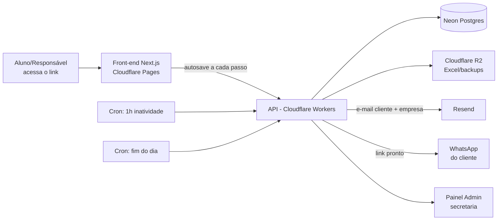

# Sistema de Matrícula Online — Redação Nota Mil

**Versão:** 1.0 · **Data:** Julho/2026 · **Prioridade:** Mobile-first

---

## 1. Visão Geral

Sistema de matrícula 100% online, acessado por um link único, onde o responsável/aluno preenche um formulário multi-etapas (wizard) para se matricular em cursos de Redação, Exatas e Matemática. O sistema salva o progresso automaticamente, avisa a secretaria se o aluno abandonar o preenchimento, envia e-mails de confirmação, gera um resumo para WhatsApp e exporta um relatório diário em Excel.

**Dados da empresa (usados no sistema, e-mails e rodapés):**

| Campo | Valor |
|---|---|
| Nome | Redação Nota Mil |
| CNPJ | 51.241.242/0001-08 |
| Endereço | Rua F, Qd. 159, Lt. 01 — Parque Tremendão |
| Telefone | (62) 98189-9570 |
| Urgência | (62) 99555-1544 |
| E-mail | naredacaonota1000@gmail.com |

---

## 2. Diferenciais / Novidades do Sistema

Coisas que vão além do "formulário comum" e valem a pena entrar no MVP:

- **Barra de progresso animada** mostrando "Passo 3 de 9 — 33% concluído", com nomes das etapas.
- **Cálculo de idade em tempo real** assim que a data de nascimento é digitada (e isso decide sozinho se o Passo 2 aparece ou é pulado).
- **Autosave silencioso**: a cada campo preenchido, salva local (cache do navegador) **e** no servidor, então o aluno pode fechar o link e continuar depois de onde parou.
- **Máscaras inteligentes** de telefone, CPF e data enquanto digita, com validação instantânea (ex.: CPF inválido já avisa na hora, sem precisar submeter).
- **Transições suaves entre passos** (slide/fade), sensação de app nativo, não de formulário antigo.
- **Modo claro/escuro automático** conforme o celular do usuário.
- **Resumo "flutuante"** sempre visível (ou acessível por um botão) mostrando curso(s) e valor escolhido até agora, pra ninguém se perder no meio do processo.
- **Anti-robô discreto** (Cloudflare Turnstile) — sem aqueles captchas irritantes de "selecione os semáforos".
- **Aviso de recuperação**: se o aluno voltar ao link depois de ter abandonado, o sistema pergunta "Vi que você começou uma matrícula, quer continuar de onde parou?"
- **"Declaração digital"**: ao confirmar os avisos e concluir a matrícula, o sistema registra nome digitado + data/hora + IP como um registro de aceite (não é assinatura digital certificada, mas serve como prova de ciência).

---

## 3. Stack Tecnológica Recomendada

Sua base (Cloudflare + Neon + GitHub) é uma ótima escolha para esse projeto — é rápido, barato (tem planos gratuitos generosos) e escala bem sem servidor para manter. Seguem as peças que encaixam nessa base:

| Camada | Tecnologia sugerida | Por quê |
|---|---|---|
| Front-end | Next.js (React) + Tailwind CSS, hospedado no **Cloudflare Pages** | Mobile-first fácil de fazer com Tailwind; Next.js roda bem no Cloudflare |
| Animações | Framer Motion | Transições suaves entre passos do wizard |
| Back-end / API | **Cloudflare Workers** (framework Hono) | Serverless, rápido, integra nativamente com o resto do Cloudflare |
| Banco de dados | **Neon** (Postgres serverless) + Drizzle ORM | Já é sua escolha; Drizzle é leve, type-safe e evita SQL injection |
| Arquivos (Excel gerado, backups) | **Cloudflare R2** | Armazenamento barato, integrado, sem taxa de saída de dados |
| E-mail transacional | **Resend** | Ótima integração com Cloudflare Workers e templates em React (React Email) |
| Tarefas agendadas (1h de inatividade, Excel diário) | **Cloudflare Cron Triggers** | Workers agendados, sem precisar de servidor rodando 24h |
| Anti-bot | **Cloudflare Turnstile** | Gratuito, mais discreto que reCAPTCHA |
| Autenticação do painel admin | Sessão simples com cookie httpOnly + senha (ou **Cloudflare Access** para algo ainda mais simples de configurar) | Só a secretaria acessa, não precisa de login social |
| Geração do Excel | Biblioteca `exceljs` | Roda dentro do Worker/cron job |
| Versionamento / Deploy | **GitHub** + GitHub Actions | Deploy automático no Cloudflare a cada push na branch principal |

> 💡 Isso é praticamente um "stack Cloudflare completo" — front, back, banco (Neon), storage e e-mail todos com planos gratuitos ou muito baratos pra esse volume de matrículas.

---

## 4. Arquitetura (visão geral)



---

## 5. Segurança e LGPD

Como o sistema coleta dados de crianças e adolescentes (nome, escola, dados dos responsáveis), a atenção com segurança e privacidade precisa ser redobrada:

- **Consentimento explícito**: no início do formulário, um texto curto explicando para que os dados serão usados (matrícula, contato e cobrança) e um checkbox de aceite, conforme a LGPD.
- **Coleta mínima**: só pedir CPF/RG se realmente for necessário para a matrícula formal (deixei como opcional, como você definiu).
- **Criptografia**: dados em trânsito (HTTPS via Cloudflare, obrigatório) e em repouso (Neon já criptografa o banco; nada de senhas ou CPF em texto puro em logs).
- **Validação em dois níveis**: no navegador (feedback instantâneo) e no servidor (nunca confiar só no front-end).
- **Rate limiting** nas rotas da API (Cloudflare tem isso pronto) para evitar spam de matrículas falsas.
- **Painel admin protegido** por login com senha forte (e, se possível, autenticação em duas etapas).
- **Log de auditoria**: registrar quando alguém do admin visualiza ou exporta dados.
- **Backups automáticos** (Neon tem point-in-time recovery nativo).
- **Direito de exclusão**: prever uma forma de apagar os dados de um aluno a pedido (exigência da LGPD).

---

## 6. Regras de Negócio — Cursos e Turmas

O aluno pode escolher **apenas uma turma por matéria** (ex.: uma de Redação + uma de Exatas, mas não duas de Redação).

### Redação — Ensino Médio (duração da aula: 1h30)

| Turma | Dia | Horário |
|---|---|---|
| R1 | Terça | 18h00 – 19h30 |
| R2 | Terça | 19h30 – 21h00 |
| R3 | Sábado | 07h30 – 09h00 |
| R4 | Sábado | 09h00 – 10h30 |

### Redação — Ensino Fundamental (duração da aula: 1h30)

| Turma | Série | Dia | Horário |
|---|---|---|---|
| R5 | 6º e 7º ano | Sábado | 10h30 – 12h00 |
| R6 | 8º e 9º ano | Sábado | 15h00 – 16h30 |

### Exatas (Física, Matemática, Química) — Ensino Médio

| Turma | Dia | Horário |
|---|---|---|
| EX1 | Segunda | 19h00 – 22h00 (bloco de 3h, ~1h por matéria) |

### Matemática Específica — Ensino Fundamental (duração da aula: 1h)

| Turma | Dia | Horário |
|---|---|---|
| MF1 | Sábado | 13h30 – 14h30 |

> ⚠️ Corrigi alguns pontos que estavam com informação incompleta — veja a seção **17. Pontos que ajustei, confirme comigo**.

---

## 7. Fluxo Completo da Matrícula

Barra de progresso visível em todos os passos. A cada campo preenchido → autosave (local + servidor).

### Passo 1 — Dados do Aluno
**Obrigatórios:** nome completo, data de nascimento (idade calculada automaticamente e exibida ao lado), e-mail, telefone/WhatsApp, série atual, onde estuda.
**Opcionais:** CPF, RG, endereço.
*A idade calculada decide se o Passo 2 aparece.*

### Passo 2 — Dados dos Responsáveis *(só aparece se menor de 18 anos)*
Nome do pai + telefone · Nome da mãe + telefone.
*(Sugestão: aceitar preencher só um dos dois, caso o aluno more só com um responsável — vale confirmar se isso deve ser obrigatório para ambos ou "pelo menos um".)*

### Passo 3 — Selecionar Turma e Horário
Lista os cursos com cards visuais (matéria, turma, dia, horário). Permite selecionar 1 turma por matéria (Redação, Exatas, Matemática), respeitando idade/série pra sugerir a turma certa (ex.: 6º ano não deveria ver a turma de Ensino Médio).

### Passo 4 — Informações do Curso (confirmação)
Assim que o aluno seleciona o(s) curso(s), aparece um aviso — moderno, com ícones — específico de cada matéria escolhida:

> **📝 Redação:** Cada aula tem 1h30 de duração. Se for faltar, avise com 3 horas de antecedência para reagendarmos a reposição. Avisos são publicados no grupo — fique bem atento.

> **📐 Exatas:** Cada aula tem 1h de duração. Este curso não tem reposição, a não ser que os professores marquem uma. Avisos são publicados no grupo — fique bem atento.

> **🧮 Matemática:** Cada aula tem 1h de duração. Avisos são publicados no grupo — fique bem atento.

Checkbox obrigatório: **"Li e estou ciente das informações acima"** para avançar.

### Passo 5 — Modalidade e Valores
⚠️ *Aviso fixo no topo:* **"Depois de escolher a modalidade não é possível voltar atrás pelo site. Pense bem antes de confirmar — para alterar depois, é só na secretaria."**
Os valores só aparecem **depois** de escolher a modalidade (não antes, pra não influenciar a escolha pelo preço).

| Modalidade | Obrigações | Redação | Exatas | Matemática |
|---|---|---|---|---|
| **1 — Com desconto** | Ajudar a divulgar o curso (WhatsApp e Instagram) + trazer pelo menos 1 aluno novo | R$ 150 | R$ 150 | R$ 150 |
| **2 — Desconto parcial** | Ajudar a divulgar o curso (WhatsApp e Instagram) | R$ 200 | R$ 200 | R$ 200 |
| **3 — Normal** | Nenhuma — só assistir às aulas | R$ 250 | R$ 300 | R$ 250 |

*A tela mostra o valor só do(s) curso(s) que o aluno já selecionou no Passo 3, não a tabela toda.*

**Taxa de matrícula:** R$ 100 (1 curso) · R$ 50 (2 cursos).
**Se não cumprir as obrigações da modalidade escolhida, o curso volta automaticamente para o valor da Modalidade 3 (normal).** Deixar esse aviso bem visível antes da confirmação.

### Passo 5.1 — Plano de Pagamento

**Plano Mensal** — paga mês a mês, no valor da tabela acima.

**Plano Trimestral** (Agosto, Setembro, Outubro):

| Modalidade | Redação | Exatas | Matemática |
|---|---|---|---|
| 1 | R$150 × 3 = **R$ 450** | R$150 × 3 = **R$ 450** | R$150 × 3 = **R$ 450** |
| 2 | R$200 × 3 = **R$ 600** | R$200 × 3 = **R$ 600** | R$200 × 3 = **R$ 600** |
| 3 | R$250 × 3 = **R$ 750** | R$300 × 3 = **R$ 900** | R$250 × 3 = **R$ 750** |

**Plano Total** (Agosto, Setembro, Outubro, Novembro — 2 aulas):

| Modalidade | Redação | Exatas | Matemática |
|---|---|---|---|
| 1 | R$150 × 4 = **R$ 600** | R$150 × 4 = **R$ 600** | R$150 × 4 = **R$ 600** |
| 2 | R$200 × 4 = **R$ 800** | R$200 × 4 = **R$ 800** | R$200 × 4 = **R$ 800** |
| 3 | R$250 × 4 = **R$ 1.000** | R$300 × 4 = **R$ 1.200** | R$250 × 4 = **R$ 1.000** |

O sistema mostra o cálculo (ex.: "R$ 150 × 3 meses = R$ 450") em vez de só o total, como você pediu.

### Passo 6 — Forma de Pagamento
- **Dinheiro à vista** → 5% de desconto adicional sobre o valor do plano escolhido.
- **Cartão (crédito ou débito)** → sujeito à taxa da maquininha no momento do pagamento (deixar esse valor configurável no painel admin, já que a taxa muda).
- **Pix** → dados enviados pelo WhatsApp da empresa logo após o pedido de matrícula ser recebido.

*Só é informativo aqui — sem cobrança online, conforme você definiu.*

### Passo 7 — Rematrícula Automática
Puxa automaticamente a forma de pagamento e a turma escolhidas no formulário.
Se a forma de pagamento for Pix → usa o número do aluno (ou de um dos pais, se o aluno for menor).
Aviso fixo: **"A modalidade escolhida vale até o fim do curso. Só é possível alterar na secretaria."**
Pergunta final: **Ativar rematrícula automática? Sim / Não**

### Passo 8 — Avisos Finais e Ciência
- Pagamento vence todo dia 5 do mês. Se não conseguir pagar em dia, é só avisar a secretaria — vamos te ajudar a organizar.
- Faltas na Redação → falar com a secretaria para agendar a reposição.
- Cada bloco de aviso tem seu próprio checkbox **"Estou ciente"** — todos precisam estar marcados para avançar.

### Passo 9 — Revisão Final
Mostra um resumo completo (aluno, curso, turma, modalidade, plano, valor, forma de pagamento) e pede para **confirmar e-mail e telefone** antes de enviar.
Botão **"Confirmar e Fazer Matrícula"** → estado de carregamento até a matrícula ser salva e os e-mails enviados com sucesso → tela de confirmação.

### Passo Final — Registro no WhatsApp
Mostra um resumo bem apresentado da matrícula (visual, tipo "cartão de confirmação") e um botão **"Enviar registro no WhatsApp"**, que abre o WhatsApp já com a mensagem pronta para o número da empresa: **(62) 98189-9570**. O cliente só confirma e envia — isso funciona como o registro oficial da matrícula.

---

## 8. Autosave / Cache

- A cada campo preenchido (com um pequeno atraso de ~800ms para não sobrecarregar), salva local no navegador e sincroniza com o servidor via um `token` de sessão único gerado no primeiro acesso ao link.
- Se o aluno fechar a aba e voltar pelo mesmo link, o sistema recupera automaticamente o progresso salvo e pergunta se quer continuar.
- Esse mesmo registro em progresso é a base do e-mail de abandono (próxima seção).

---

## 9. Fluxo de Abandono (1h de Inatividade)

Um cron job roda periodicamente e verifica: matrículas com `status = "em andamento"` e `última atividade > 1 hora atrás`.

Quando detectado, envia e-mail **para naredacaonota1000@gmail.com**, personalizado com os dados que já foram preenchidos até ali:

> **Assunto:** ⚠️ Matrícula não finalizada — [Nome do aluno, se preenchido]
>
> Olá, equipe Redação Nota Mil!
>
> Uma matrícula ficou parada há mais de 1 hora e pode ter sido abandonada. Segue o que já foi preenchido até agora, para vocês entrarem em contato se fizer sentido:
>
> - **Nome:** [nome ou "não preenchido"]
> - **Idade:** [idade ou "—"]
> - **E-mail:** [email ou "—"]
> - **Telefone/WhatsApp:** [telefone ou "—"]
> - **Série:** [série ou "—"]
> - **Onde estuda:** [escola ou "—"]
> - **Curso(s) em andamento:** [curso(s) selecionado(s) até o momento, se houver]
> - **Último passo preenchido:** Passo [X] de 9
> - **Parou às:** [data e hora]
>
> Se quiser, dá pra chamar no WhatsApp/e-mail cadastrado e ajudar a concluir a matrícula. 😊
>
> — Sistema de Matrícula, Redação Nota Mil

Cada registro só dispara **um** e-mail de abandono (marca `abandono_notificado = true` para não notificar de novo se a pessoa nunca mais voltar).

---

## 10. E-mails de Confirmação de Matrícula

Ao concluir o Passo 9 com sucesso, dois e-mails são enviados (mesmo conteúdo, personalizado):
1. Para o e-mail do cliente/responsável cadastrado.
2. Para naredacaonota1000@gmail.com (empresa).

> **Assunto:** ✅ Matrícula confirmada — [Nome do aluno] | Redação Nota Mil
>
> Olá, [Nome do aluno / responsável]!
>
> Sua matrícula na **Redação Nota Mil** foi recebida com sucesso. Aqui está o resumo:
>
> **Aluno:** [nome] · [idade] anos
> **Curso(s):** [curso] — Turma [X] · [dia] das [horário]
> **Modalidade:** [modalidade escolhida]
> **Plano:** [mensal/trimestral/total] — [detalhamento do cálculo]
> **Forma de pagamento:** [forma escolhida]
> **Taxa de matrícula:** R$ [valor]
> **Rematrícula automática:** [sim/não]
>
> Próximo passo: envie o resumo da sua matrícula pelo WhatsApp da nossa equipe para confirmarmos tudo certinho.
>
> Qualquer dúvida, fale com a gente:
> 📞 (62) 98189-9570 · urgência (62) 99555-1544
> ✉️ naredacaonota1000@gmail.com
> 📍 Rua F, Qd. 159, Lt. 01 — Parque Tremendão
>
> Bem-vindo(a) à Redação Nota Mil! 🎉

---

## 11. Mensagem para o WhatsApp (Passo Final)

Link gerado automaticamente no formato `https://wa.me/5562981899570?text=...` com a mensagem pronta:

> Olá! Acabei de concluir minha matrícula na Redação Nota Mil. Segue meu resumo:
>
> 👤 Aluno: [nome]
> 📚 Curso: [curso] — Turma [X]
> 💳 Modalidade: [modalidade] · Plano: [plano]
> 💰 Valor: R$ [valor]
> 📱 Contato: [telefone]
>
> Este é o registro da minha matrícula. Obrigado(a)!

*(Você escolheu o modelo "abre o WhatsApp com mensagem pronta" — o cliente só confirma e envia. Fica registrado como comprovante direto na conversa da empresa.)*

---

## 12. Exportação Diária em Excel

Todo dia (cron às 23h59, por exemplo), o sistema gera uma planilha `.xlsx` com todas as matrículas **concluídas** naquele dia e salva no Cloudflare R2 (disponível para download no painel admin).

**Colunas sugeridas:**

| Coluna |
|---|
| Data/Hora da matrícula |
| Nome completo do aluno |
| Data de nascimento |
| Idade |
| E-mail |
| Telefone/WhatsApp |
| Série atual |
| Onde estuda |
| CPF (se preenchido) |
| RG (se preenchido) |
| Endereço (se preenchido) |
| Nome do pai / telefone |
| Nome da mãe / telefone |
| Curso(s) e turma(s) |
| Modalidade |
| Plano de pagamento |
| Valor mensal |
| Valor total do plano |
| Forma de pagamento |
| Rematrícula automática (Sim/Não) |
| Status (Concluída / Abandonada) |

---

## 13. Painel Administrativo (simples)

- Login protegido (usuário/senha) para a secretaria.
- Lista de matrículas com filtros por data, curso e status (concluída/abandonada).
- Clicar numa matrícula → ver todos os detalhes preenchidos.
- Botão **"Baixar Excel de hoje"** (ou de um período escolhido).
- Indicador simples de quantas matrículas foram feitas no dia/semana.

---

## 14. Modelo de Dados (rascunho do schema)

```sql
-- alunos
CREATE TABLE students (
  id UUID PRIMARY KEY DEFAULT gen_random_uuid(),
  full_name TEXT NOT NULL,
  birth_date DATE NOT NULL,
  email TEXT NOT NULL,
  phone TEXT NOT NULL,
  grade TEXT NOT NULL,
  school TEXT NOT NULL,
  cpf TEXT,
  rg TEXT,
  address TEXT,
  created_at TIMESTAMPTZ DEFAULT now()
);

-- responsáveis (se menor de idade)
CREATE TABLE guardians (
  id UUID PRIMARY KEY DEFAULT gen_random_uuid(),
  student_id UUID REFERENCES students(id),
  father_name TEXT,
  father_phone TEXT,
  mother_name TEXT,
  mother_phone TEXT
);

-- matrícula
CREATE TABLE enrollments (
  id UUID PRIMARY KEY DEFAULT gen_random_uuid(),
  student_id UUID REFERENCES students(id),
  modality TEXT NOT NULL,        -- 'desconto' | 'desconto_parcial' | 'normal'
  plan TEXT NOT NULL,             -- 'mensal' | 'trimestral' | 'total'
  payment_method TEXT NOT NULL,   -- 'dinheiro' | 'cartao' | 'pix'
  auto_renew BOOLEAN DEFAULT false,
  status TEXT DEFAULT 'em_andamento', -- 'em_andamento' | 'concluida' | 'abandonada'
  current_step INTEGER DEFAULT 1,
  session_token TEXT UNIQUE,
  abandoned_notified BOOLEAN DEFAULT false,
  last_activity_at TIMESTAMPTZ DEFAULT now(),
  created_at TIMESTAMPTZ DEFAULT now(),
  completed_at TIMESTAMPTZ
);

-- cursos/turmas escolhidos dentro de uma matrícula
CREATE TABLE enrollment_courses (
  id UUID PRIMARY KEY DEFAULT gen_random_uuid(),
  enrollment_id UUID REFERENCES enrollments(id),
  subject TEXT NOT NULL,   -- 'redacao' | 'exatas' | 'matematica'
  class_code TEXT NOT NULL -- 'R1', 'EX1', 'MF1' etc.
);
```

---

## 15. Roadmap Sugerido

**Fase 1 — MVP (o que está descrito acima)**
- Fluxo completo dos 9 passos + autosave
- E-mails de confirmação e de abandono
- Exportação diária em Excel
- Link de WhatsApp com mensagem pronta
- Painel admin simples

**Fase 2 — Melhorias futuras (não precisa agora, mas fica registrado como ideia)**
- Pagamento online automático (Pix via gateway, ex. Mercado Pago)
- Envio automático via WhatsApp Business API (sem precisar o cliente clicar)
- Painel admin com estatísticas (cursos mais procurados, taxa de abandono, receita prevista)
- Notificação automática para o próprio aluno confirmando lembrete de vencimento
- Sistema de cupom/código de indicação para rastrear quem trouxe quem (Modalidade 1)

---

## 16. Pontos que Ajustei — Confirme Comigo

Encontrei algumas informações que pareciam ter um pequeno erro de digitação. Ajustei usando o que fez mais sentido, mas vale você confirmar:

1. **Turma R2 (Redação):** você escreveu "terça 19h30 às 19h" — ajustei para **19h30 às 21h**, mantendo a aula de 1h30 como as demais.
2. **Turma R6 (Redação Fundamental):** não veio o dia da semana — assumi **Sábado**, mesmo dia da R5. Confirma?
3. **Plano Total, Modalidade 3:** o texto original tinha "× 3" em vez de "× 4" e não estava rotulado como "Modalidade 3" — corrigi para manter o padrão de 4 meses.
4. **Taxa de matrícula:** ficou R$ 100 para 1 curso e R$ 50 para 2 cursos (menor pra quem faz mais cursos) — mantive exatamente como você descreveu, só quis confirmar que essa lógica "inversa" é mesmo intencional.
5. **Taxa da maquininha (cartão):** como ela varia, deixei sugerido como um valor configurável no painel admin, em vez de fixo no sistema.
6. **Passo 2 (responsáveis):** deixei nome + telefone do pai **e** da mãe como pedido, mas se o aluno morar só com um dos dois, talvez faça sentido aceitar preencher apenas um. Me avisa se quiser esse ajuste.

---

## 17. Próximos Passos

Esse documento serve como especificação completa para começar o desenvolvimento. Sugestão de ordem:
1. Criar o repositório no GitHub e configurar Cloudflare Pages + Workers.
2. Modelar o banco no Neon com o schema acima (posso te ajudar a gerar as migrations).
3. Construir o wizard do front-end passo a passo (posso ajudar com o código de cada tela).
4. Configurar Resend para os e-mails e Cloudflare Cron Triggers para abandono + Excel diário.
5. Construir o painel admin simples por último, já com dados reais fluindo.

Quer que eu comece já pelo código do primeiro passo (formulário de dados do aluno com cálculo de idade e autosave), ou prefere ver antes um protótipo visual (mockup) de como as telas vão ficar?
